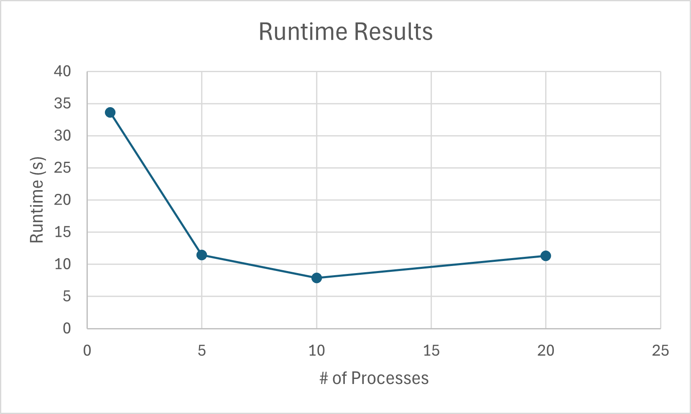
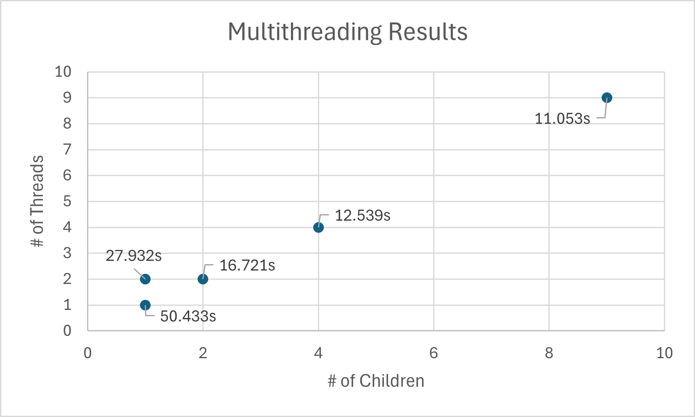

<!--
Name: Ryan Pal Hilgendorf
Assignment: Lab 11 & 12
Secton: CPE 2600 121
-->

# System Programming Lab 11 Multiprocessing

The changes to mandel.c started by generating all 50 images, zooming out, with a for loop. This logic was then taken into account when forking, which produces a specific number of children all with their own assigned set of images to generate. The scale each image is at is also predetermined, so even when generating asynchronously the final results are in order.

### Generated graph of results based on number of children:

You can see that the time for completion starts to increase after hitting a low at 10 children. This is likely due to the fact that the laptop the experiment was run on has 12 cores, meaning that going beyond 12 children will begin to hinder the CPU. This also means that 12 children is the sweet spot, but it is not present in this experiment.

Note as of completing lab 12: I realize this is probably not correct, but it was my initial analysis so it's staying :)

---

# System Programming Lab 12 Multithreading

This time, the method compute_image() was modified. It was completely changed to decide the data, create, and finally join each thread. This data is then taken to a new method called threading() where the number of rows a thread will compute is decided, the start and end points are decided, and the original calculations from compute_image() are done instead.

### Generated graph of Multithreading results based on number of threads and children:

Multithreading seemed to impact the runtime far more. I believe this is due to splitting up the workload each child handles. As seen with the first two tests, doing two threads instead of one on one child nearly halves the runtime. The game becomes exponentially less the more is added to each, but it does seem multithreading is the most effective. The sweet spot for both seems to be around 10-10. I tried 9-9 to show an odd number case, and also tested 20-20, which took marginally longer than 9-9. I did not include 20-20 on the graph due to constraining the space of the smaller tests too much.